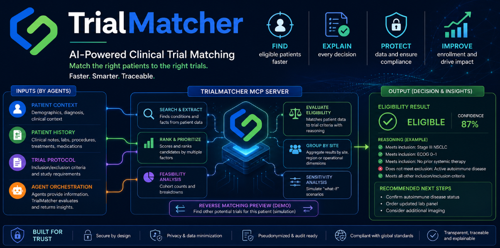
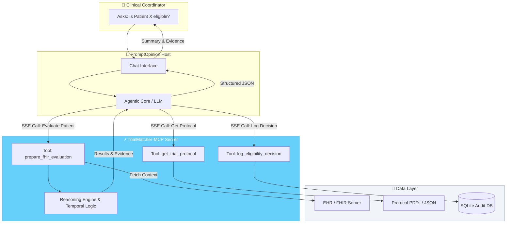
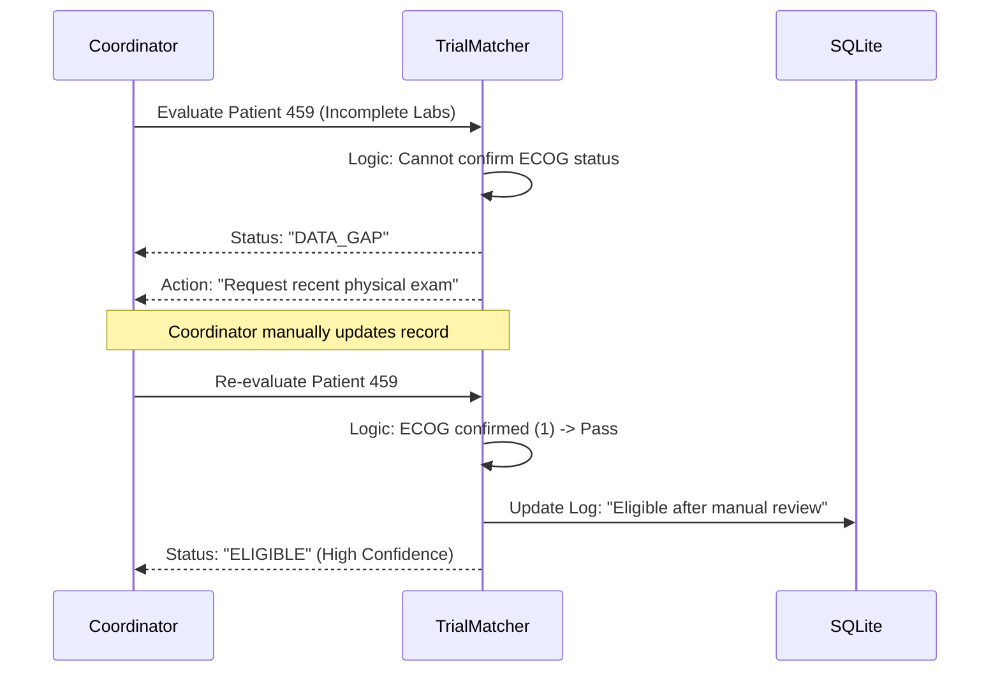
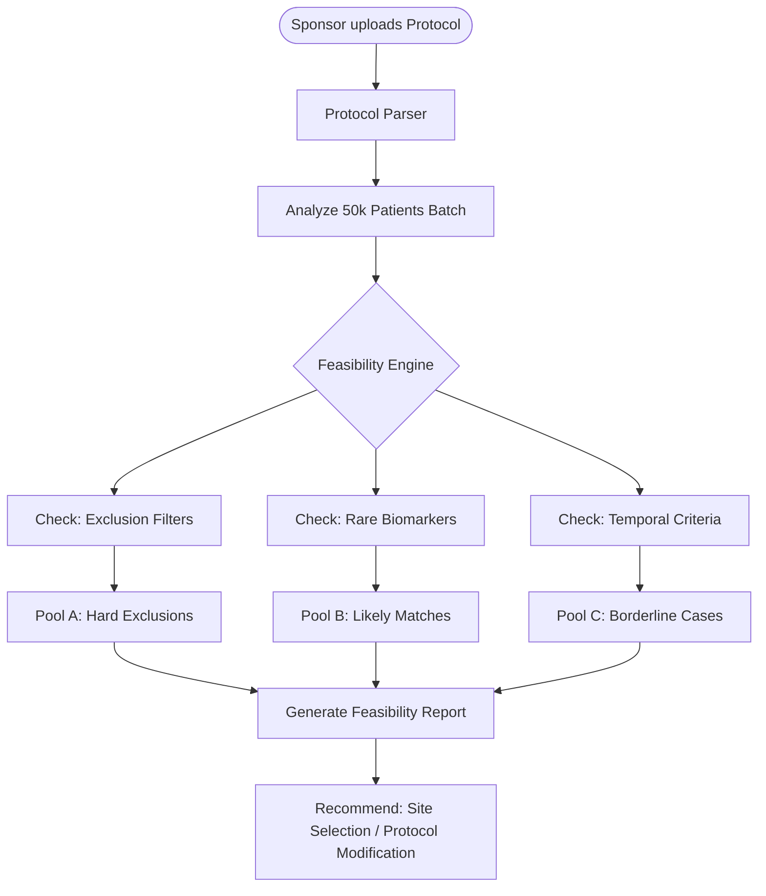
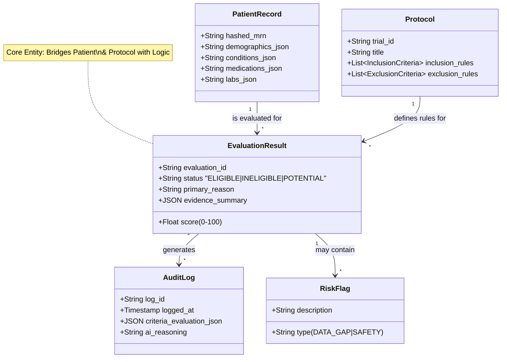
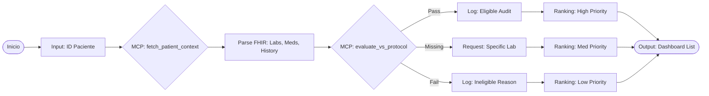

# TrialMatcher: Bridging the $2.3B Clinical Trial enrollment Gap

**TheAI-PoweredClinicalTrialOrchestrationEngine**

[ ](https://modelcontextprotocol.io/)[ ](https://chat.z.ai/c/LICENSE)



## 🚀 TheExecutiveSummary

80% of clinical trials fail to meet enrollment timelines, costing the industry billions and delaying life-saving treatments.

**TrialMatcher** is an Agnostic Clinical Candidate Processor built on the Model Context Protocol (MCP). Unlike simple eligibility checkers, TrialMatcher is a fully operational AI engine that transforms heterogeneous clinical data into a prioritized, audit-ready short list of eligible patients.

By leveraging **Conversational Interoperability (COIN)**, we bridge the gap between unstructured patient data (EHRs, PDFs) and complex trial protocols, reducing screening time from weeks to hours while maintaining strict regulatory compliance.



---

## 🎯 Why TrialMatcher?

### The Problem

- **Heterogeneous data:** Patient info is scattered across FHIR servers, PDFs, and free-text notes.
- **Protocol complexity:** Criteria involving temporal logic ("≥3 months stability") are impossible to query via SQL alone.
- **Audit blindspots:** AI decisions often lack the clinical evidence trail required by Pharma compliance.

### The Solution

- **Agentic workflow:** An AI agent retrieves patient data while another parses protocols; TrialMatcher MCP conducts the match.
- **Non-Binary logic:** We don't just return "Eligible/NotEligible". We are able to identify "Potential Matches", "Data Gaps", and "Missing Lab Requirements".
- **Audit-Ready by design:** Every action, change, or match decision is backed by a "Clinical Reasoning Trace", citing specific record IDs, timestamps, and values.

## ✨ Key Capabilities

### 1. Universal data ingestion

Agnostic compatibility with HL7/FHIR, major EHRs (Epic, Cerner), and unstructured sources (PDFs, ClinicalNotes).

### 2. Protocol intelligence 🧠

Automatically parses complex protocols to extract temporal criteria and biomarkers.

- Example: "Detects that 'Metformin stable' requires verifying start dates against current labs."

### 3. Advanced eligibility engine

Moves beyond binary classification:

- Eligible / Possibly Eligible / Not Eligible / Data Gap.
- Un certainty Handling: Flags cases needing "Physician Review" (Human-in-the-loop).

#### 3.1 Stratified Multi-Criteria Scoring Model (MCDA)

To ensure clinical objectivity, regulatory transparency, and auditability, TrialMatcher rejects unweighted "black box" heuristics. Instead, the AI operates under a Multi-Criteria Decision Analysis (MCDA) framework combined with a mathematical Hard-Stop Rule to compute patient eligibility scores.

[ Protocol Retrieval via Search Tool ]
│
▼
┌───────────────────────────┐
│ Stratified Weighting │
│ • HIGH (3) • MED (2) │
│ • LOW (1) │
└─────────────┬─────────────┘
│
▼
┌───────────────────────────┐
│ Compliance Multiplier │
│ • MET: 1.0 • GAP: 0.5 │
│ • NOT_MET: 0.0 │
└─────────────┬─────────────┘
│
▼
❌ Does any HIGH criterion ────── YES ────► [ SCORE = 0 ]
trigger a NOT_MET status? (Hard-Stop Rule)
│
│ NO
▼
┌───────────────────────────┐
│ Algebraic Equation │
│ Σ(Wi × Ci) / ΣWi × 100 │ ─────────────► [ FINAL SCORE ]
└───────────────────────────┘

1. Stratified Weighting System ($W$)Every inclusion and exclusion criterion extracted from clinical protocol documents is categorized based on clinical severity and impact on patient safety:HIGH ($W = 3$): Critical, non-negotiable determinants (e.g., exact histopathological diagnosis, specific genomic mutations, or age requirements).MEDIUM ($W = 2$): Secondary clinical conditions or manageable comorbidities (e.g., controlled hypertension, body mass index limits).LOW ($W = 1$): Secondary lab thresholds, administrative, or logistically flexible requirements.2. Compliance Multiplier ($C$)The evaluation engine processes the patient's FHIR context against each rule within the evidence_summary array and assigns a strict numeric modifier based on its specific status:MET = $1.0$ (Complete alignment with clinical evidence).MISSING / DATA_GAP = $0.5$ (Clinical uncertainty; penalizes the case without triggering an outright rejection).NOT_MET = $0.0$ (Failure to satisfy the condition).3. The Absolute Hard-Stop RuleSafety Overrule: If any mandatory inclusion criterion evaluates to NOT_MET with a weight of HIGH, or an absolute exclusion criterion is triggered, the engine executes an immediate algebraic bypass. The final score automatically plummets to 0, overrunning any other matching criteria. This enforces safety and absolute compliance.4. Mathematical EquationWhen a patient passes all hard-stops, the system calculates the final eligibility percentage by establishing a ratio between the weighted score obtained and the maximum possible clinical score:

   $$
   Score = \left( \frac{\sum (W_i \times C_i)}{\sum W_i} \right) \times 100
   $$

   Where $W_i$ represents the assigned weight of the criterion $i$ (HIGH = 3, MEDIUM = 2, LOW = 1), and $C_i$ represents the compliance modifier (MET = 1, MISSING = 0.5, NOT_MET = 0). Minor secondary deductions can be applied mathematically based on active risk_indicators to arrive at a balanced, predictable, and fully traceable final score.

#### 3.2 Use Case: Patient with incomplete lab data - Sequence Diagram



### 4. Smart Ranking & Prioritization

Commercially powerful scoring algorithms:

- Probability of enrollment score.
- Risk of screen failure score.
- Prioritization by data completeness and geographic proximity.

### 5. Multi-Trial routing (The "Inverter")

Not just "Patient-> Trial," but "Patient-> All Applicable Trials." Crucial for finding alternatives when a patient fails a primary screen.

### 6. What-if analysis (Feasability analysis)

Analyst, scientific or MD, can apply and run feasability analysis, real-time, no need to re-process everything, just move a variable a ask "What if...".



## 🔒 Compliance & Security

We are built for the highly regulated Pharma environment.

- **Data minimization:** Only necessary fields are processed formatching.
- **Pseudonymization:** SHA-256 hashing of MRNs ensures privacy while maintaining auditability.
- **Audit trails:** Immutable logs of who accessed what data and when.
- **Regional compliance:** Designed with GDPR (EU), HIPAA (US), and LGPD (LATAM) principles in mind.

## 🏗️ Architecture highlights

- **Core:** `FastMCP` server with `SSE`transport.
- **Backend:** Python-based processing with SQLite local persistence.
- **Interoperability:** Native FHIR context support.
- **Frontend:** Exposes tools via PromptOpinion ecosystem.

## 📱Database model



## 🛠️ Installation & Usage

### Prerequisites

- Python 3.11+
- Ngrok (for local testing)

### QuickStart

```bash
# Clone the repo

git clone https://github.com/jcordovaj/TrialMatcher.git

cd TrialMatcher

# Install dependencies

pip install -r requirements.txt

# Run the MCP server

python main.py
```

### IntegrationwithPromptOpinion

1. Run `ngrok http 8000`.
2. Add a new MCP server in PromptOpinion.
3. Transport: `StreamableHttp`.
4. Endpoint: YourNgrokURL + `/mcp`.

## 📈 Roadmap and future vision

- **Protocol sandbox :** "What if we lowered the ECOG criteria to 2?" Simulation tools.
- **GenomicsIntegration:** Support for NGS panels and Biomarkers (PD-L1, EGFR).
- **CRMIntegration :** Direct work flow to site coordinators.

## 💎 For Investors and Pharma Industry members

TrialMatcher is not a classifier. It is an Operational Engine for clinical operations based on GenAI.

We increase the probability of trial success by providing an explainable AI layer that sits on top of messy, real-world hospital data, ensuring that every recruitment decision is fast, safe, and scientifically justified.

## Walkthrough

### 1. Fast Screening


